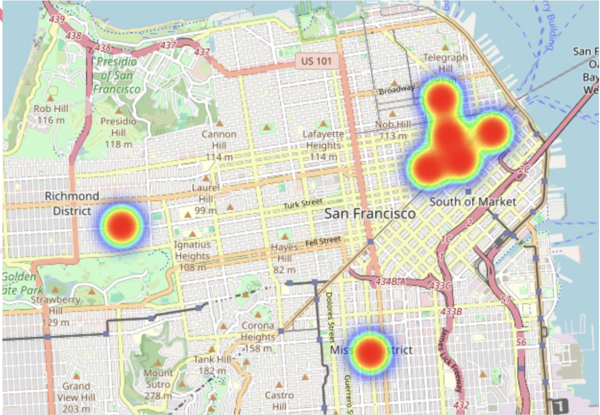
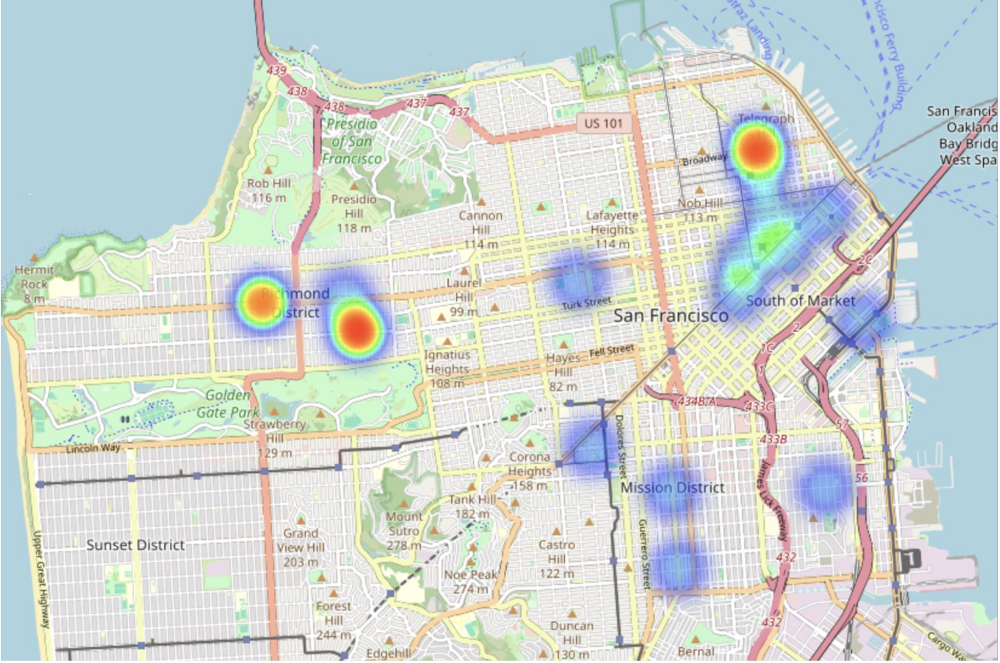
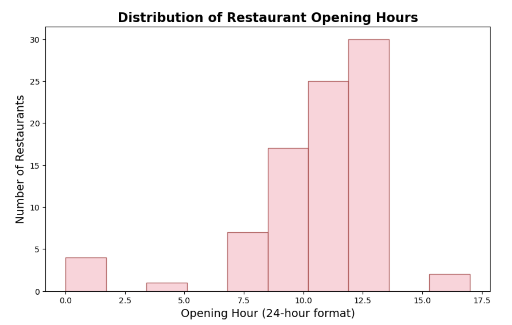
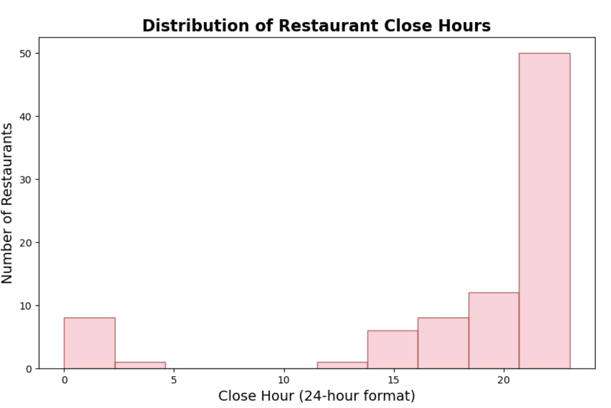
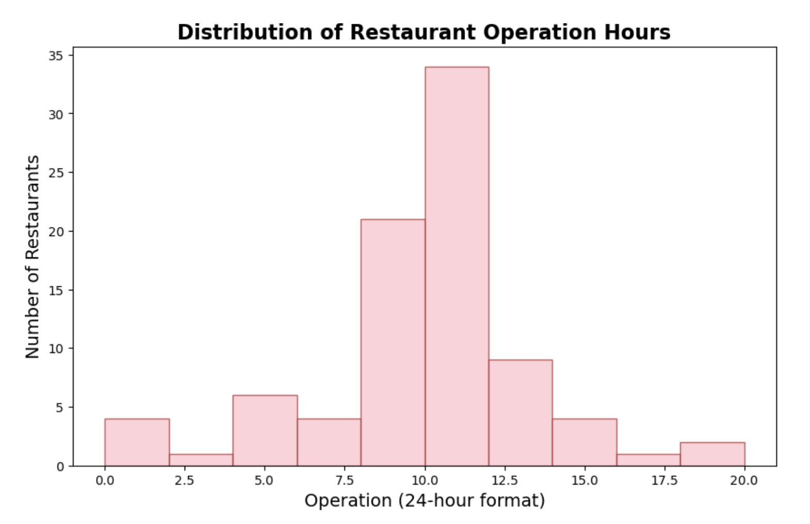

# Business-Open-Toolkit
#### This is a creative project! It aims to provide some ideas to business men or women who have ideas to operate a business but don't know where to hit the road. It utilizes skills of APIs and python in asscessing data from websties. Here are the steps and details:
* Not matter what you want, tell us your idea firstly :)!
* Get google map API to draw a heatmap of traffic in the city you want to operate business in
* Get Yelp API to analyze top competitors in the city
* Get GoogleAI API to generate strategies for you! 
  
## API connection process
*Google Map*
```
import requests

## Set boundary for all SF
types = ["shopping_mall", "tourist_attraction", "transit_station", "restaurant"]
results = []

for place_type in types:
    response = requests.get("https://maps.googleapis.com/maps/api/place/nearbysearch/json", params={
        "location": "37.7529,-122.4474",
        "radius": 1000000,
        "type": place_type,
        "key": "put your key"
    })
    results.extend(response.json().get("results", []))
```
*Yelp*
```
API_KEY = "###put your key"
headers = {"Authorization": f"Bearer {API_KEY}"}

# Function to fetch data with pagination
def get_yelp_data(offset):
    response = requests.get(
        "https://api.yelp.com/v3/businesses/search",
        headers=headers,
        params={
            "location": "San Francisco, CA",
            "categories": "icecream",
            "limit": 50,
            "offset": offset,
            "sort_by": "rating"
        }
    )
    return response.json()
```
*Google AI*
```
from google import genai
client = genai.Client(api_key="##get your key")

response = client.models.generate_content(
    model="gemini-1.5-flash", contents=
    """Provide business strategy for opening an icecream shop in San Francisco. You should consider following information:
    1. According to heatmap, the place with traffic-heavy place are Inner Richmand, Mission District, Union Square, and Financial District.
    2. According to heatmap, the place with most popular icecream are Inner Richmand, Middle Richmand, North Beach.
    3. The average operating hours is 9.41, and the most frequent opening time is 11:00, the most frequent closing time is 21:00.
    4. The regional data shows that Top50 rating icecream are in: Mission: 19, Downtown: 15, North Beach: 9, Richmond: 8, Nob Hill: 4, Marina: 4, Sunset: 2, Financial District: 1
    """
)
print(response.text)
```
## Some Key Results

|  |  | 
|----------------------|----------------------|

| # | Region              | Shop Count |
|---|---------------------|-----------|
| 1 | Mission            | 19        |
| 2 | SOMA/Downtown      | 15        |
| 3 | North Beach        | 9         |
| 4 | Richmond           | 8         |
| 5 | Sunset             | 4         |
| 6 | Nob Hill           | 4         |
| 7 | Marina             | 2         |
| 8 | Financial District | 1         |


|  |  |  |
|----------------------|----------------------|----------------------|

## Summary

Recommendations: Ice Cream Shop in SF

| **Category**           | **Details** |
|------------------------|------------|
| **Optimal Location**   | **Financial District** |
|                        | - Close to offices |
|                        | - High foot traffic |
|                        | - Little competition |
| **Target Customer**    | Tourists, office workers |
| **Optimal Operating Hours** | **11AM – 9PM** |
|                        | - The average operating hours of Top 100 competitors in SF is 10 hours |
|                        | - Most of the restaurants nearby close around this time |
|                        | - May change depending on season |
